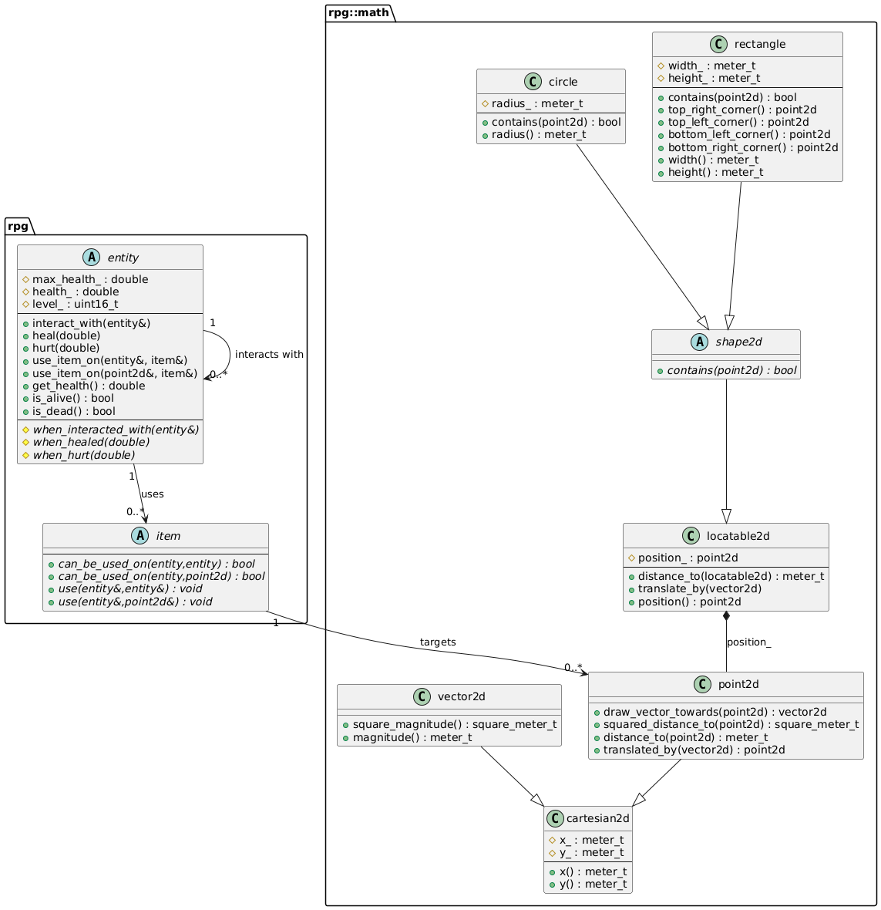

# itesm-rpg
This is an RPG-style game made for a class.

You are a player trapped in an unknown dungeon. This dungeon contains multiple
rooms, some with treasure, some with monsters. Your job is to exit this dungeon
with as much loot as possible.

Every room will be represented by an $n \times m$ grid, where $n, m$ depend on
the room type you encounter. Each position has the chance of spawning items or
entities which you can interact with. Discover new weapons and armor, apply
crazy status effects, battle intense foes and conquer the dungeon!

## UML Diagram



## Build Instructions

### CMake
If you have CMake installed, then its as easy as running the following commands

```sh
mkdir build && cd build
cmake ..
```

### No CMake
There are certain requirements to build this project without CMake. Working on
a multiplatform solution as we speak.

- Use C++23
- Include the `src/rpg` in your include path

## Disclaimers

It is in no way intended to be a full engine and as such it does not cover
every use case and it is not as performant.
